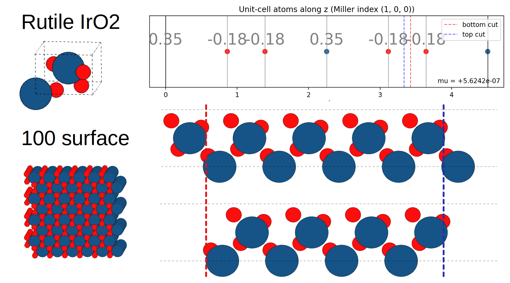

# taskerslabgen

Utilities to generate non-polar (Tasker I/II/III) slab terminations from first-principles structures using ASE `Atoms` objects and formal or computed charges. The library:

- projects atoms along the surface normal for any Miller index
- clusters atoms into planes
- enumerates Tasker cut pairs with stoichiometry + charge neutrality + dipole checks
- performs Tasker III surface reconstruction (symmetric deletion, bond scoring)
- extracts termination fingerprints and matches planes across slabs
- plots planes with IDs, compositions, cut lines, and match highlighting
- builds cut slabs for a list of thicknesses

## Diagram

See `docs/images/cutdiagram_IrO2rutile100.png` for a schematic overview.



## Folder layout

- `src/taskerslabgen/core.py`  
  Core logic: projection, plane clustering, cut enumeration, selection,
  termination fingerprinting (`extract_termination`, `plane_match_score`),
  `generate_slabs_for_miller`, `cutslab`.
- `src/taskerslabgen/plotting.py`  
  Atom-along-z plots with plane IDs, compositions, cut lines, and
  reference-match highlighting.
- `src/taskerslabgen/builder.py`  
  Builds slabs by cutting a surface for each thickness.
- `src/taskerslabgen/tasker3.py`  
  Tasker III surface reconstruction: adjacency matrix, symmetric deletion,
  bond/distribution scoring.
- `src/taskerslabgen/chargeparsers.py`  
  Charge parsing helpers (FHI-aims Hirshfeld).
- `example/genslab.py`  
  Example: generate non-polar slabs for multiple Miller indices.
- `example/cutslab.py`  
  Example: cut an existing thick slab into thinner non-polar slabs.
- `example/cutslab_ref.py`  
  Example: tandem workflow -- use `genslab` to produce a thick slab,
  then `cutslab` with `reference_termination` to produce thinner slabs
  that preserve the same surface termination.
- `example/visualize_slab.py`  
  Example: generate and visualise a (001) slab with ASE.
- `bulk_files/`  
  Example bulk input files (`IrO2_rutile.out`, `CeO2.cif`).
- `example/output/`  
  Output folder created by the example scripts (plots and slabs).

## Outputs

The example scripts write (into `example/output/`):

- `*_atoms.png` or `*_refcut.png`  
  Plot of atoms along z with plane IDs, compositions, charges, and cut
  lines. In reference-termination mode, matched planes are highlighted
  in green.
- `*_layers_{thickness}.{ext}` 
  Slab structure files for each requested thickness.

File names include the bulk file stem, Miller index, and thickness.

## Reference-termination workflow

When working with relaxed supercells, the recommended workflow is:

1. **genslab** -- call `generate_slabs_for_miller` on the bulk to produce
   a thick non-polar slab (e.g. 13 layers).  This determines the optimal
   Tasker termination.
2. **cutslab with reference** -- call `cutslab` on the thick slab,
   passing the thick slab (or any other slab) as `reference_termination`.
   `cutslab` extracts the termination fingerprint (elemental composition
   + fractional xy positions), matches it against every plane in the
   input structure, and only produces sub-slabs whose top and bottom
   planes match the reference.

Matching uses a hard stoichiometry constraint and a soft xy-position
similarity score (Hungarian assignment with PBC, controlled by `plane_tol`).

## Install

From the repo root:

```
pip install -e .
```

Requires Python >= 3.9, ASE, NumPy, Matplotlib, SciPy.

## Example use

### genslab

```
python example/genslab.py
```

### cutslab with reference termination

```
python example/cutslab_ref.py
```
