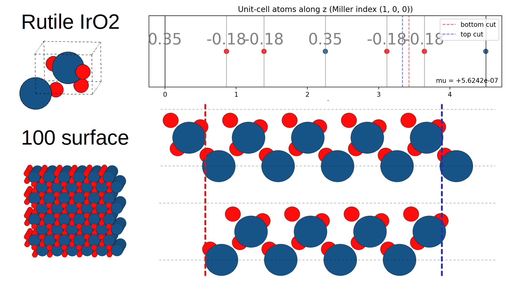

# taskerslabgen

Utilities to generate stoichiometric non-polar (Tasker I/II/III) slab
terminations from first-principles structures using ASE `Atoms` objects and
formal or computed charges.

Relative to pymatgen cleavage / Tasker-2 half-ion moves, Surfaxe zero-dipole
filters, and Hinuma-style nonpolar slab algorithms, this library emphasises an
ASE-native Tasker I/II→III workflow with scored reconstructions and a
`genslab`→`cutslab` thickness series that preserves termination chemistry.

The library:

- projects atoms along the surface normal for any Miller index
- clusters atoms into planes (single-linkage on z, fixed 0.1 Å tolerance, as in pymatgen)
- enumerates Tasker cut pairs with stoichiometry + charge neutrality + dipole checks
- performs Tasker III surface reconstruction (symmetric deletion; exact slab
  dipole from the atoms that remain; ranking by dangling bonds on the true bulk
  lattice, then a Coulomb-energy distribution score that spreads like charges apart)
- plane labels from arrangement and phase (`O`, `O'`, `IrO2-a`): planes are compared
  as smooth periodic densities, so shifted or rotated copies of a plane (different
  stackings) get different labels, while copies one repeat unit apart share one
- cuts thick slabs into thinner sub-slabs preserving termination
- per-cut plots with unique Miller-index-aware filenames
- checks every returned slab: stoichiometric, neutral, non-polar
  (raises `SlabValidationError` otherwise)

## Diagram

See `docs/images/cutdiagram_IrO2rutile100.png` for a schematic overview.



## Install

From the repo root:

```bash
python3 -m pip install -U pip setuptools wheel
python3 -m pip install -e ".[dev]"
```

Requires Python >= 3.9, ASE, NumPy, Matplotlib, SciPy.

If editable install fails on an older system `pip`, either upgrade pip or run:

```bash
python3 -m pip install --no-build-isolation -e ".[dev]"
```

## Quick start

Examples are headless by default (write structures; no GUI). Add `--view` or
`--plot` when you want interactive viewing or PNG stacking plots.

### Tasker III reconstructions (CeO2 fluorite)

```bash
python example/CeO2_fluorite.py
```

### Tasker I/II multiple Miller indices (IrO2 rutile)

```bash
python example/IrO2_rutile.py
```

### Silicate example (albite NaAlSi₃O₈)

```bash
python example/NaAlSi3O8_albite.py
```

### Tandem genslab + cutslab (supercell)

```bash
python example/x2supercell_CeO2_fluorite.py
```

### Plane phases (shape / relative / absolute selection)

```bash
python example/plane_phases.py --view
```

### Cutting a relaxed slab (`cutslab(bulk_atoms=...)`)

```bash
python example/relaxed_cutslab.py
python example/relaxed_cutslab.py --slab slab.out --bulk bulk.out --miller 1 1 0
```

### Batch slab generation

```bash
python example/batch_unitcell_slabs.py --quick
```

See [`example/TUTORIAL.md`](example/TUTORIAL.md) for a short narrative walkthrough
and [`example/BATCH_SLABS.md`](example/BATCH_SLABS.md) for batch setup.

---

## Plane labels: arrangement and phase

Every plane is treated as a wave: a smooth periodic density with one Gaussian
per atom (no cutoffs).  Two planes have the same **arrangement** when one wave
overlaps the other after some in-plane shift or rotation, and the same
**phase** when they overlap as they are.  A label is both:

| Label | Meaning |
|---|---|
| `O4`, `Ce2O4` | composition per surface cell (metals first) |
| `O`, `O'`, `O''`, `O'''`, `O'4` | one arrangement in different phases: shifted or rotated copies of the same plane, i.e. different stackings |
| `IrO2-a`, `IrO2-b` | different arrangements of one composition (no shift or rotation maps one onto the other) |
| `O4-recon` | Tasker III reconstructed plane |
| `O4~` | relaxed plane deformed beyond `deform_tol` (with `bulk_atoms=`) |

Phases are relative to the crystal: a plane and its copy one repeat unit
higher share a label, even where the tilted repeat vector puts the copy
sideways in the slab.  Phases are numbered bottom to top in the bulk cell
(rotated phases by a fingerprint that does not depend on the bulk origin).

`prefer_plane` (genslab) and `cut_at` (cutslab) select planes by label, as
`selection` says:

| `selection` | `"O'"` selects | Example |
|---|---|---|
| `"relative"` (default) | only `O'`: same arrangement, same phase in the crystal | anatase (101): keeps the termination; the other O₂ phases (Ti 0.15 Å under the surface instead of 0.73 Å) are excluded |
| `"absolute"` (cutslab) | also exactly over the input slab's own surface plane | rutile (110): only every second thickness, where the top bridging-O row sits over the bottom one as in the input |
| `"shape"` | `O`, `O'`, `O''`, ...: the arrangement in any phase | rutile (100): adds the half repeat units ending on another O phase |

Every sub-slab reports `cut_phase_overlap` (1 when its top plane lies exactly
over its bottom plane, a---a; about 0 when shifted, a---a').  A genslab
termination is `[plane_type, top_plane_type]`; pass both to `cut_at`.  For
file names use `plane_name_for_filename("O4'") == "O4p"`.
`example/plane_phases.py` walks through the three cases with ASE GUI views.

---

## Primary API

Start with these two functions:

| Function | Role |
|----------|------|
| `generate_slabs_for_miller` | Classify Tasker I/II vs III and build slabs |
| `cutslab` | Peel a thick slab into a thickness series |

Also at the top level: `reconstruct_tasker_iii` (the Tasker III path on its
own), `validate_slab` / `SlabValidationError`, the label helpers
`plane_name_matches` / `plane_name_base`, and `parse_hirshfeld_fhi_aims`.
Lower-level steps (plane clustering, cut enumeration, bonding, Tasker III
candidates, builders) are in `taskerslabgen.advanced`; importing them from
`taskerslabgen` still works but is deprecated.

Library defaults are quiet: `plot=False` and prints only when `verbose=True`.

Every slab returned by `generate_slabs_for_miller`, `cutslab` and
`reconstruct_tasker_iii` is checked to be stoichiometric, charge-neutral
and non-polar (on the actual atoms); a `SlabValidationError` is raised
otherwise.  When no slab can satisfy the conditions (for example a polar
stacking that symmetric deletion cannot fix, or an odd excess that needs an
in-plane supercell) a `ValueError` explains why instead of returning a polar
or non-stoichiometric structure.

---

## Tandem genslab + cutslab workflow

When working with relaxed supercells, the recommended workflow is:

1. **genslab** — call `generate_slabs_for_miller` on the bulk to produce
   a thick non-polar slab.  This determines the optimal Tasker
   termination (including Tasker III reconstruction if needed).
2. **cutslab** — call `cutslab` on the thick slab with
   `cut_at="termination"` and `cuts="right"` (default).  The bottom
   plane is fixed and the code peels from the top, generating every
   valid thickness down to a single plane.  For Tasker III surfaces,
   pass the `reconstruction` dict from the genslab output so that
   newly exposed interior planes receive the same atomic deletion.

**Relaxed slabs.** Pass the bulk: `cutslab(relaxed, Q, bulk_atoms=bulk,
dipole_tol=0.3)`.  Planes are then matched to the bulk planes, so rumpled or
shifted surface planes stay whole and keep their bulk label; a surface that
deviates more than `deform_tol` (or changed composition) is labelled with
`~` (`O4~`) and still counts as an `O4` termination.  Stoichiometry, charge
and dipole of every cut are evaluated on the actual relaxed atoms, so a cut
that keeps one relaxed surface can be rejected as polar; relaxed slabs
usually need `dipole_tol≈0.3`.

### Tasker III limitation

When a reconstruction pattern is provided, requesting `cut_at="all"` is
forced to `"termination"`. Prefer `cut_at="termination"` explicitly for
reconstructed surfaces so newly exposed planes keep the same deletion mask.

---

## API Reference

### `generate_slabs_for_miller`

```python
from taskerslabgen import generate_slabs_for_miller

result = generate_slabs_for_miller(
    bulk_atoms,
    charges,
    millers,
    layer_thickness_list,
    bulk_name="slab",
    plane_tol=None,
    charge_tol=1e-3,
    dipole_tol=0.05,
    vacuum=15.0,
    plot=False,
    plot_out_dir=".",
    verbose=None,
    bond_threshold=(0.85, 1.15),
    bond_distances=None,
    prefer_plane=None,
    candidates="best",
    savecandidates=False,
    surface_supercell=None,
    max_masks=200000,
    dipole_tol_max=None,
    selection="relative",
)
```

Generate non-polar slabs for one or more Miller indices.  Automatically
classifies each surface as Tasker I/II (zero dipole) or Tasker III
(requires reconstruction).

**Parameters**

| Parameter | Type | Default | Description |
|---|---|---|---|
| `bulk_atoms` | `Atoms` | *required* | Bulk unit cell (ASE `Atoms` object). |
| `charges` | `dict`, `list` or `None` | *required* | Formal charges.  Dict maps element symbols (e.g. `{"Ce": 4.0, "O": -2.0}`) or atomic numbers to values; list gives per-atom charges; `None` uses the charges stored on the `Atoms` (calculator results `"charges"`, else `initial_charges`). |
| `millers` | `tuple` or `list[tuple]` | *required* | Single Miller index `(h, k, l)` or list of Miller indices. |
| `layer_thickness_list` | `list[int]` | *required* | Slab thicknesses in bulk repeat units (e.g. `[2, 4, 6]`); a Tasker I/II slab of thickness *n* contains exactly *n* bulk repeat units. |
| `bulk_name` | `str` | `"slab"` | Label used in plot and output filenames. |
| `plane_tol` | `float` or `None` | `None` | Largest z-gap (Å) between neighbouring atoms of one plane (single-linkage clustering). `None` = 0.1 Å. |
| `charge_tol` | `float` | `1e-3` | Largest net charge per formula unit (e) treated as neutral. |
| `dipole_tol` | `float` | `0.05` | Largest \|dipole\| per formula unit (e·Å) treated as zero: below it the surface is Tasker I/II, and Tasker III reconstructions must also stay below it. Polar repeat units are ~1–6 e·Å per formula unit; relaxed bulks may need ~0.3. |
| `vacuum` | `float` | `15.0` | Vacuum (Å) added to each side of the slab. |
| `plot` | `bool` | `False` | Generate stacking-axis plots showing planes and cuts. |
| `plot_out_dir` | `str` | `"."` | Directory for output plots. |
| `verbose` | `bool` or `None` | `None` | Print detailed information (plane sequences, candidates, etc.). |
| `bond_threshold` | `tuple[float, float]` | `(0.85, 1.15)` | `(lo, hi)` scaling factors applied to the bond reference distance: Tasker III bond scores and the broken-bond ranking of Tasker I/II terminations. |
| `bond_distances` | `dict` or `None` | `None` | Per-pair bond reference distances (see below). |
| `prefer_plane` | see below | `None` | Plane-type filter applied before candidate selection. |
| `candidates` | `str` | `"best"` | `"best"` or `"all"` (see below). |
| `savecandidates` | `bool` | `False` | Save all valid candidates to an extxyz file. |
| `max_masks` | `int` | `200000` | Largest number of Tasker III deletion patterns to enumerate (before symmetry reduction); above it a `ValueError` is raised instead of running for hours. |
| `surface_supercell` | `(n1, n2)` or `None` | `None` | Repeat the surface cell in-plane before cutting (e.g. a Tasker III plane with an odd excess per surface).  Keeps the facet, unlike `bulk_atoms * (2, 2, 1)`.  Labels then count supercell atoms. |
| `dipole_tol_max` | `float` or `None` | `None` | Opt-in fallback for slightly distorted (e.g. relaxed) bulks: when no slab of a facet is non-polar within `dipole_tol`, rebuild it with the smallest tolerance that works, up to this cap, and warn.  Facets that succeed are unaffected; the tolerance used is returned as `info["dipole_tol"]` (pass it to `cutslab`).  `None` raises `PolarSurfaceError`. |
| `selection` | `str` | `"relative"` | How a plane label in `prefer_plane` selects: `"relative"` only that plane (arrangement and phase), `"shape"` the arrangement in any phase. See [Plane labels](#plane-labels-arrangement-and-phase). |

**`bond_distances` format**

Keys are `"X-Y"` strings (order irrelevant), e.g. `"Ce-O"`.  Values are either:
- `float` — reference distance (Å), scaled by `bond_threshold` to determine bonding
- `None` — forbid that pair entirely (no bond is created between those elements)

Pairs not listed use the default rule: bonded within `bond_threshold` ×
the sum of covalent radii.  That rule also counts metal–metal contacts —
real bonds in e.g. rutile IrO₂ (Ir–Ir chains), but not in CeO₂, where Ce–Ce
at 3.87 Å would otherwise make up 12 of the 20 bonds cut at (110).  Check
`candidate["broken_bonds_by_pair"]` and set such pairs to `None` when they are
not bonds in your material.

In the Tasker III distribution score, unlisted pairs contribute their Coulomb
energy `q_i q_j / d_ij` (your charges), so like charges spread apart (a
half-occupied O plane prefers a checkerboard); listed pairs keep the rules
above (`None`: repulsive `1/d`, float: `|d - d_ref|`).

Example:
```python
bond_distances={"Ce-Ce": None, "O-O": None, "Ce-O": 2.35}
```

**`prefer_plane` options**

| Value | Behaviour |
|---|---|
| `None` | No filtering — all terminations returned. |
| `int` (e.g. `0`) | Keep only the termination with that numeric ID. |
| `list[int]` (e.g. `[0, 2]`) | Keep terminations with those IDs. |
| `str` element (e.g. `"O"`) | Keep terminations whose cut plane consists **exclusively** of that element. `"O"` matches pure-O planes but NOT mixed CeO planes. |
| `str` plane label (e.g. `"O4'"`) | Keep terminations whose bottom plane label matches, as `selection` says: only `O4'` (and `O4'-recon`) with `"relative"`, every phase `O4`, `O4'`, ... with `"shape"`. See [Plane labels](#plane-labels-arrangement-and-phase). |
| `list[str]` (e.g. `["O", "Ce"]`) | Keep terminations matching **any** entry. Each element match is exclusive — `["O", "Ce"]` keeps pure-O OR pure-Ce planes but not mixed CeO. |

**`candidates` options**

| Value | Behaviour |
|---|---|
| `"best"` | Return only the single best candidate per Miller index. Tasker I/II: fewest bulk bonds broken at the cut, then densest surface planes (`candidate["broken_bonds"]`, `candidate["broken_bonds_by_pair"]`, `candidate["surface_density"]`); IDs follow this ranking. Tasker III: candidates must stay neutral and non-polar for every thickness from the thinnest requested one up; ranked by `bond_score` (bulk bonds the slab's atoms lose at both surfaces), then `distribution_score`; IDs follow this ranking.  Deletion patterns related by a symmetry of the crystal that keeps the stacking direction are one termination (`candidate["multiplicity"]` counts them). |
| `"all"` | Return every valid candidate, generating a separate plot for each. |

**Returns**

Nested dict: `{miller_tuple: {plane_id: info_dict}}`.

Each `info_dict` contains:
- `"atoms"` — list of `Atoms` objects (one per thickness)
- `"tasker_type"` — `"I/II"` or `"III"`
- `"plane_type"` — label of the bottom surface plane (e.g. `"O4"`, `"O4-recon"`); `cutslab` uses the same labels
- `"top_plane_type"` — label of the top surface plane; differs from `plane_type` for asymmetric terminations, so cut with `cutslab(cut_at=[plane_type, top_plane_type])` (or the default `cut_at="termination"`)
- `"plane_counts"` — `{atomic_number: count}` composition of the cut plane
- `"reconstruction"` — reconstruction metadata dict (Tasker III; JSON-serialisable, pass it to `cutslab(reconstruction=...)`) or `None`
- `"candidate"` — raw scoring dict with dipole, bond score, etc.
- `"dipole_tol"` — the dipole tolerance the slabs were built and checked with (`dipole_tol`, or larger after the `dipole_tol_max` fallback)

Each `Atoms` object carries metadata in `.info`:
- `"bulk_name"` — the `bulk_name` parameter
- `"miller"` — the Miller index tuple

---

### `cutslab`

```python
from taskerslabgen import cutslab

sub_slabs = cutslab(
    input_structure,
    charges,
    axis=2,
    plane_tol=None,
    charge_tol=1e-3,
    dipole_tol=0.05,
    plot_out_dir=".",
    plot=False,
    verbose=None,
    bond_threshold=(0.85, 1.15),
    bond_distances=None,
    reconstruction=None,
    cut_at="termination",
    cuts="right",
    vacuum=15.0,
    bulk_atoms=None,
    miller=None,
    deform_tol=0.3,
    selection="relative",
)
```

Cut an existing thick slab into thinner sub-slabs preserving surface
termination.

**Parameters**

| Parameter | Type | Default | Description |
|---|---|---|---|
| `input_structure` | `Atoms` or path | *required* | Thick slab to cut. |
| `charges` | `dict`, `list` or `None` | *required* | Formal charges (same format as `generate_slabs_for_miller`; `None` reads them from the slab, e.g. computed charges of a relaxed slab). |
| `axis` | `int` | `2` | Cartesian axis perpendicular to the surface (0=x, 1=y, 2=z). |
| `plane_tol` | `float` or `None` | `None` | Largest z-gap (Å) between neighbouring atoms of one plane (single-linkage clustering). `None` = 0.1 Å. |
| `charge_tol` | `float` | `1e-3` | Largest net charge per formula unit (e) treated as neutral. |
| `dipole_tol` | `float` | `0.05` | Largest \|dipole\| per formula unit (e·Å) of a sub-slab treated as zero; relaxed slabs usually need ~0.3. |
| `plot_out_dir` | `str` | `"."` | Directory for output plots. |
| `plot` | `bool` | `False` | Generate a stacking-axis plot for each sub-slab. |
| `verbose` | `bool` or `None` | `None` | Print plane stacking and cut details. |
| `bond_threshold` | `tuple[float, float]` | `(0.85, 1.15)` | Unused; kept for backward compatibility. |
| `bond_distances` | `dict` or `None` | `None` | Unused; kept for backward compatibility. |
| `reconstruction` | `dict` or `None` | `None` | Tasker III reconstruction dict from genslab output (`term["reconstruction"]`, JSON-serialisable). Newly exposed copies of the reconstructed plane receive the same deletions, placed as genslab places them; in-plane supercells of the slab work. Forces `cut_at="termination"` if `cut_at` was `"all"`; an explicit `cut_at` must select the `-recon` label to expose copies. |
| `cut_at` | `str` or `list[str]` | `"termination"` | Where to place cuts (see below). |
| `cuts` | `str` | `"right"` | Direction of cuts (see below). |
| `vacuum` | `float` | `15.0` | Vacuum (Å) added to each side of every sub-slab. |
| `bulk_atoms` | `Atoms` or `None` | `None` | Bulk the slab was built from: its unit cell or a supercell of it (e.g. a relaxed bulk calculation), up to a few per cent of strain. Each atom is assigned to the nearest bulk plane (registry learned from the slab interior), so relaxed surface planes that rumple or shift stay whole; each plane gets its bulk label (`O4`), or `O4~` if it deviates by more than `deform_tol` or its composition changed. Recommended for relaxed slabs. |
| `miller` | `tuple` or `None` | `None` | Miller index of the slab, needed with `bulk_atoms`; defaults to `slab.info["miller"]` (set by genslab). |
| `deform_tol` | `float` | `0.3` | RMSD (Å, after the best rigid shift) up to which a slab plane still counts as its bulk plane. |
| `selection` | `str` | `"relative"` | How plane labels select cut planes: `"relative"` (that plane, any repeat unit), `"absolute"` (also exactly over the input slab's surface plane), `"shape"` (the arrangement in any phase). See [Plane labels](#plane-labels-arrangement-and-phase). |

**`cut_at` options**

| Value | Behaviour |
|---|---|
| `"termination"` | Every sub-slab has the input's bottom plane at the bottom and its top plane at the top (matched as `selection` says). |
| `"all"` | Cut at any plane that gives a stoichiometric, charge-neutral, zero-dipole sub-slab (contiguous runs of planes only, never across the vacuum). Automatically forced to `"termination"` when `reconstruction` is provided. |
| `str` (e.g. `"O4'"`) | Both ends of every sub-slab are planes with this label (as `selection` says). |
| `list[str]` (e.g. genslab's `[plane_type, top_plane_type]`) | Both ends are planes matching any of the listed labels. |

**`cuts` options**

| Value | Behaviour |
|---|---|
| `"right"` (default) | Fix bottom plane, peel from the top. Produces slabs of decreasing thickness. |
| `"left"` | Fix top plane, peel from the bottom. |
| `"all"` | Keep every valid cut (all combinations of bottom/top boundaries). |

**Returns**

`list[Atoms]` — sub-slabs sorted from smallest to largest by atom count,
each checked to be stoichiometric, neutral and non-polar.
If no valid cut exists a `ValueError` says why; for a polar (Tasker III) slab,
build it with `generate_slabs_for_miller` and pass `reconstruction=` instead.

Each `Atoms` object carries metadata in `.info`:
- `"cut_bottom_plane"` — label of the bottom surface plane (`...-recon` if reconstructed)
- `"cut_top_plane"` — label of the top surface plane
- `"cut_bottom_idx"` — integer index of the bottom plane
- `"cut_top_idx"` — integer index of the top plane
- `"cut_n_planes"` — number of atomic planes in the sub-slab

Supports single-plane slabs (1 atomic plane thick).

---

### `build_adjacency_matrix`

```python
from taskerslabgen.advanced import build_adjacency_matrix

adj = build_adjacency_matrix(
    atoms,
    bond_threshold=(0.85, 1.15),
    bond_distances=None,
    bulk_atoms=None,
    miller=None,
)
```

Build a bond-count matrix using covalent radii and PBC: `adj[i, j]` is the
number of periodic images of atom *j* bonded to atom *i* (use `adj > 0` for a
boolean view).

| Parameter | Type | Default | Description |
|---|---|---|---|
| `atoms` | `Atoms` | *required* | Structure to compute bonds for. |
| `bond_threshold` | `tuple[float, float]` | `(0.85, 1.15)` | `(lo, hi)` scaling factors on the reference distance. |
| `bond_distances` | `dict` or `None` | `None` | Per-pair reference distances. |
| `bulk_atoms` | `Atoms` or `None` | `None` | Original bulk cell, for `atoms = build_surface(bulk_atoms, miller)`: periodic images then follow the true bulk lattice in the surface frame (`surface_bulk_cell`). |
| `miller` | `tuple` or `None` | `None` | Miller index of `atoms`; required with `bulk_atoms`. |

Returns an `(N, N)` integer `ndarray` (symmetric bond counts).

---

### `assign_plane_names`

```python
from taskerslabgen.advanced import assign_plane_names

names, name_map = assign_plane_names(planes_sorted, atoms=None, axis=2, same_plane=0.9)
```

Label planes by arrangement and phase (see
[Plane labels](#plane-labels-arrangement-and-phase)): ``O4``, ``O4'``,
``IrO2-a``.  Planes are compared by the normalised overlap of their smooth
densities (Gaussian width 0.5 Å, converged image sums): same arrangement if
some lattice rotation and shift makes them overlap, same phase if they overlap
as they are.  Phases are numbered in the order of *planes_sorted*; genslab
and cutslab call it on one bulk repeat unit so that copies a lattice repeat
apart share a label.

Helpers: `plane_name_base("IrO2-a'-recon") == "IrO2"`;
`plane_name_matches(query, name, selection)` implements `prefer_plane` /
`cut_at`; `plane_name_for_filename("O4'") == "O4p"`.

| Parameter | Type | Default | Description |
|---|---|---|---|
| `planes_sorted` | `list[dict]` | *required* | Planes in stacking order. |
| `atoms` | `Atoms` or `None` | `None` | Provide to compare geometries (otherwise composition only). |
| `axis` | `int` | `2` | Stacking axis. |
| `same_plane` | `float` | `0.9` | Normalised overlap (0-1) from which two planes count as the same. |

Returns `(names, name_map)` where `names[i]` is the label of
`planes_sorted[i]` and `name_map` is `{label: counts_dict}`.

---|---|---|---|
| `planes_sorted` | `list[dict]` | *required* | Planes sorted by z-centre. |
| `atoms` | `Atoms` or `None` | `None` | Provide to tell geometric variants apart (otherwise composition only). |
| `axis` | `int` | `2` | Stacking axis. |
| `xy_tol` | `float` | `0.5` | Matching tolerance (Å, in-plane) for corresponding atoms. |

Returns `(names, name_map)` where `names[i]` is the label of
`planes_sorted[i]` and `name_map` is `{label: counts_dict}`.

---

### `reconstruct_tasker_iii`

```python
from taskerslabgen import reconstruct_tasker_iii

result = reconstruct_tasker_iii(
    bulk_atoms, charges, miller, layer_thickness_list, bulk_name,
    plane_tol=None, charge_tol=1e-3, dipole_tol=0.05,
    vacuum=15.0, plot=False, plot_out_dir=".",
    verbose=None, bond_threshold=(0.85, 1.15),
    bond_distances=None, prefer_plane=None, surface_supercell=None,
)
```

Standalone Tasker III reconstruction pipeline.  Can be called directly
when you already know the surface is Tasker III.

Returns a dict with `"slab_atoms"`, `"best_candidate"`,
`"all_candidates"`, `"tasker_type"`, and `"plot"` path.

---

### Advanced helpers

Import these from `taskerslabgen.advanced` (except `validate_slab` and
`parse_hirshfeld_fhi_aims`, which are top-level).

| Function | Description |
|---|---|
| `build_surface(bulk_atoms, miller, layers, vacuum, verbose)` | Build an ASE surface slab from a bulk structure. |
| `compute_projection(bulk, surf_bulk, charges, miller, verbose)` | Compute `[Z, z, q]` matrix and lattice-plane spacing *L*. |
| `identify_planes(atoms_z, L, plane_tol, charge_tol)` | Cluster atoms into atomic planes (single-linkage; `plane_tol=None` = 0.1 Å). |
| `surface_bulk_cell(bulk_atoms, miller)` | True bulk lattice in the frame of `build_surface` (its third vector stacks one layer onto the next). |
| `validate_slab(slab, charges, reduced_counts, ...)` | Check stoichiometry, neutrality and dipole (optionally internal gaps); raises `SlabValidationError`. |
| `compute_reduced_counts(atoms_z)` | Compute reduced (primitive) stoichiometry. |
| `is_stoichiometric_sequence(sequence_counts, reduced_counts)` | Check if a sequence is a whole-number multiple of bulk formula. |
| `enumerate_cut_pairs(planes, L, reduced_counts, charge_tol)` | Enumerate all contiguous plane sequences with charge/dipole info. |
| `select_best_sequence(sequences, dipole_tol)` | Select the best full-period stoichiometric sequence (dipole per formula unit). |
| `compute_cut_positions(planes, L, bottom_cut_index, top_cut_index)` | Compute z-coordinates for bottom and top cuts. |
| `apply_vacuum_to_slab(atoms, vacuum, axis)` | Add vacuum above and below a slab. |
| `compute_delete_info(cut_plane, deletion_mask, atoms_z_matrix, surf_bulk)` | Extract reconstruction deletion pattern as `(Z, fx, fy)` tuples. |
| `build_cut_slabs(bulk_atoms, miller, layer_thickness_list, zbot, ztop, L, vacuum)` | Build Tasker I/II slabs at various thicknesses. |
| `plot_unitcell_atoms(atoms_z, L, miller, ...)` | Stacking-axis plot with plane annotations. |
| `parse_hirshfeld_fhi_aims(output_path)` | Parse the last Hirshfeld charges of an FHI-aims output file (`atoms.set_initial_charges(...)`, then `charges=None`). |
| `print_adjacency_matrix(adj, atoms)` | Print adjacency matrix with element labels. |
| `find_tasker3_candidates(planes_sorted, atoms_z_matrix, ...)` | Enumerate and score Tasker III reconstruction candidates. |
| `build_tasker3_slabs(bulk_atoms, miller, ...)` | Build Tasker III slabs with symmetric reconstruction. |

---

## Folder layout

- `src/taskerslabgen/core.py` — shared utilities: projection, plane
  clustering, cut enumeration, composition plane labels, termination
  fingerprinting.
- `src/taskerslabgen/genslab.py` — `generate_slabs_for_miller`.
- `src/taskerslabgen/slabcut.py` — `cutslab`.
- `src/taskerslabgen/tasker3.py` — Tasker III reconstruction: adjacency
  matrix, symmetric deletion, bond/distribution scoring.
- `src/taskerslabgen/plotting.py` — stacking-axis plots.
- `src/taskerslabgen/builder.py` — Tasker I/II slab builder.
- `src/taskerslabgen/chargeparsers.py` — charge parsing (FHI-aims
  Hirshfeld).
- `example/` — runnable example scripts and tutorial.
- `bulk_files/` — example bulk input files.
- `tests/` — regression and smoke tests (`pytest tests/`).

## Outputs

The example scripts write into `example/output*/`:

- `*_hkl_{miller}_cut_{idx}_{bot}_{top}.png` — one picture per cutslab cut
  (only when `--plot` is passed): a side view of the input slab with the
  sub-slab in colour and the rest grey, and its planes with their labels,
  coloured by the planes the selection allowed as the bottom (red) and top
  (blue) surfaces, with both cuts as dashed lines.
- Structure files for each slab / sub-slab (CIF by default in demos).

## Running tests

```bash
python3 -m pip install -e ".[dev]"
pytest tests/
```

## Changelog

See [CHANGELOG.md](CHANGELOG.md).

## License

MIT — see [LICENSE](LICENSE).
